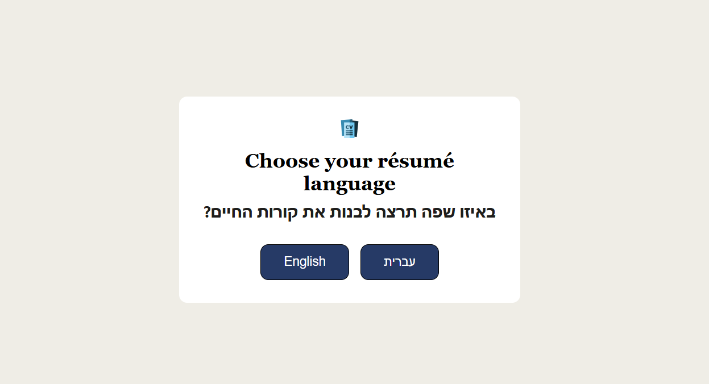
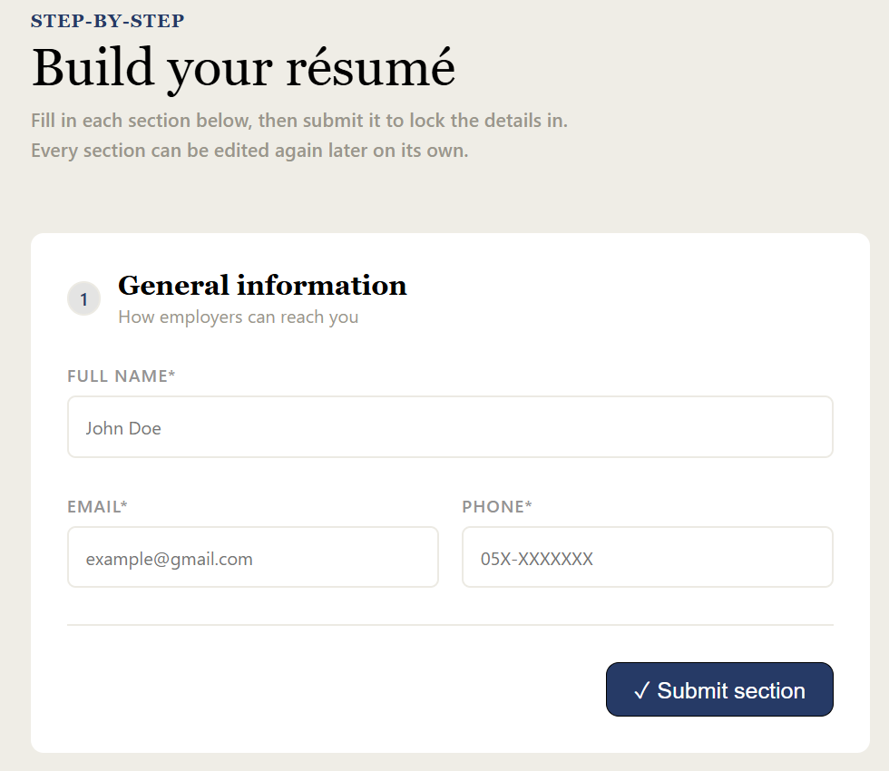
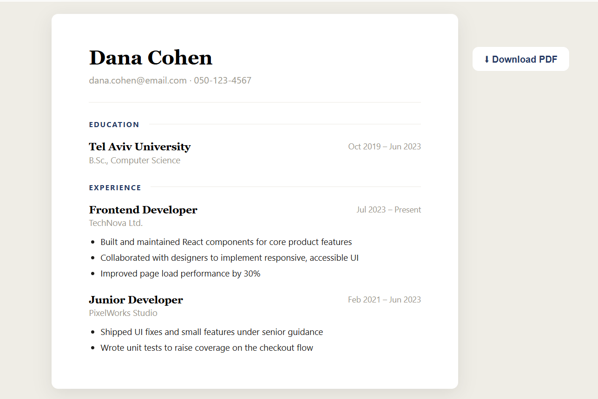

# CV Builder

Created basic CV application using React.

A step-by-step résumé builder. Fill in your details, education, and work experience one section at a time, then review everything and generate a clean, single-page résumé you can download as a PDF - in English or Hebrew.

## Features

- **Step-by-step form** - General information, Education, and Work Experience are filled in and submitted one section at a time. Any section can be reopened and edited later without losing the others.
- **Review screen** - once all three sections are submitted, a summary view shows what was entered before moving on.
- **Résumé preview** - a "Finish editing" step renders the submitted data as an actual résumé layout (name and contact header, EDUCATION / EXPERIENCE sections, dated entries, bulleted responsibilities) instead of the raw form data.
- **PDF download** - the preview has a "Download PDF" button that opens the browser's print dialog with "Save as PDF" as the destination. This keeps the résumé's text real and selectable in the exported file (as opposed to a rasterised screenshot), which is what applicant-tracking-system (ATS) parsers need to read a résumé correctly.
- **English / Hebrew, with RTL** - a language screen at the start of the flow sets the language for the whole form and the résumé itself. Hebrew switches the entire layout to right-to-left and swaps in a Hebrew-supporting font. The language can be changed later from the header without losing entered data.
- **Dev tools** - "Fill test data" instantly fills and submits all three sections with sample data (in the selected language) so the preview/PDF flow can be tested without retyping a résumé by hand each time. "Clear all" resets every section back to empty.

## Tech stack

- [React](https://react.dev/)
- [Vite](https://vitejs.dev/)
- Plain CSS (custom properties for theming, no CSS framework)

## Getting started

```bash
npm install
npm run dev
```

Then open the local URL Vite prints in the terminal.

To create a production build:

```bash
npm run build
```

## Screenshots

**Choose a language**



**Build the résumé**



**Résumé preview**

